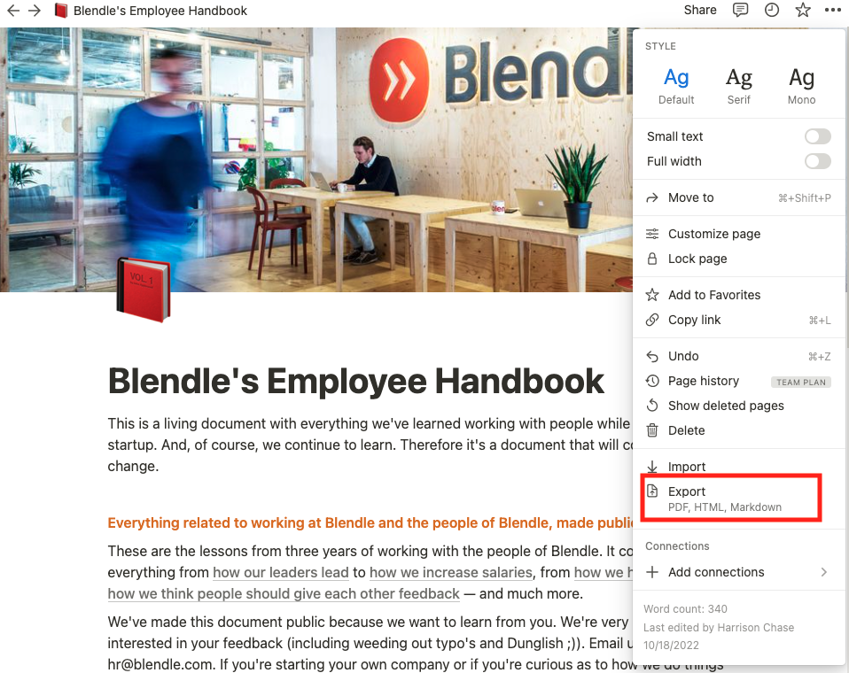
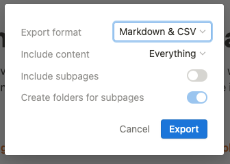

# Notion Query Assistant

This tool empowers you to interrogate your Notion database using natural language queries. This project leverages the capabilities of [LangChain](https://github.com/hwchase17/langchain) for language processing.

# Getting Started: Preparing Your Environment

To ensure the correct functioning of this tool, follow the steps below:

1. Install all necessary dependencies with the following command:

```shell
pip install -r requirements.txt
```

2. You'll also need to setup your OpenAI API key. If you don't have one yet, you can obtain it from [OpenAI's official site](https://beta.openai.com/playground). Once you have the key, set it up in your environment using the command:

```shell
export OPENAI_API_KEY=....
```

# Inside the Toolbox

Here's a brief overview of what's included in this repository:

- A sample dataset from Blendle.
- Python script for querying your Notion data with a question.
- Codebase for deployment on StreamLit.
- Guidelines for importing your own dataset into the tool.

## Sample Dataset

As an example, we have included the [Blendle Employee Handbook](https://www.notion.so/Blendle-s-Employee-Handbook-7692ffe24f07450785f093b94bbe1a09) dataset in this repository. Please note that this dataset was fetched on October 18th and may not represent the current state of the data.

## Running a Query

To pose a question, execute the following command:

```shell
python qa.py "What is the work from home policy"
```

You can replace `"What is the work from home policy"` with any question of your choice. This launches a chat-based interface for accessing information from a Notion database. It provides a more user-friendly and intuitive way of extracting information.

## Deploying the Tool on StreamLit

The necessary code to launch this tool as a StreamLit app is located in `main.py`. Please ensure to add your `OPENAI_API_KEY` as a secret environment variable while setting up the StreamLit app.

## How to Import Your Own Dataset

Here's how you can import your data from Notion:

1. Start by exporting your data from Notion. Click on the three-dot menu on the top right corner of your page and select `Export`.



2. While exporting, ensure to choose the `Markdown & CSV` format.



3. The export process results in a `.zip` file in your Downloads folder. Transfer this file into the repository's directory.

4. Use the following command to unzip the file (Replace `Export...` with the actual filename).

```shell
unzip Export-d3adfe0f-3131-4bf3-8987-a52017fc1bae.zip -d Notion_DB
```

5. Now, ingest the data into the tool with this command:

```shell
python ingest.py
```

That's it! You've successfully ingested your own data. Now you can query it as follows:

```shell
python chat.py "What is the work from home policy"
```